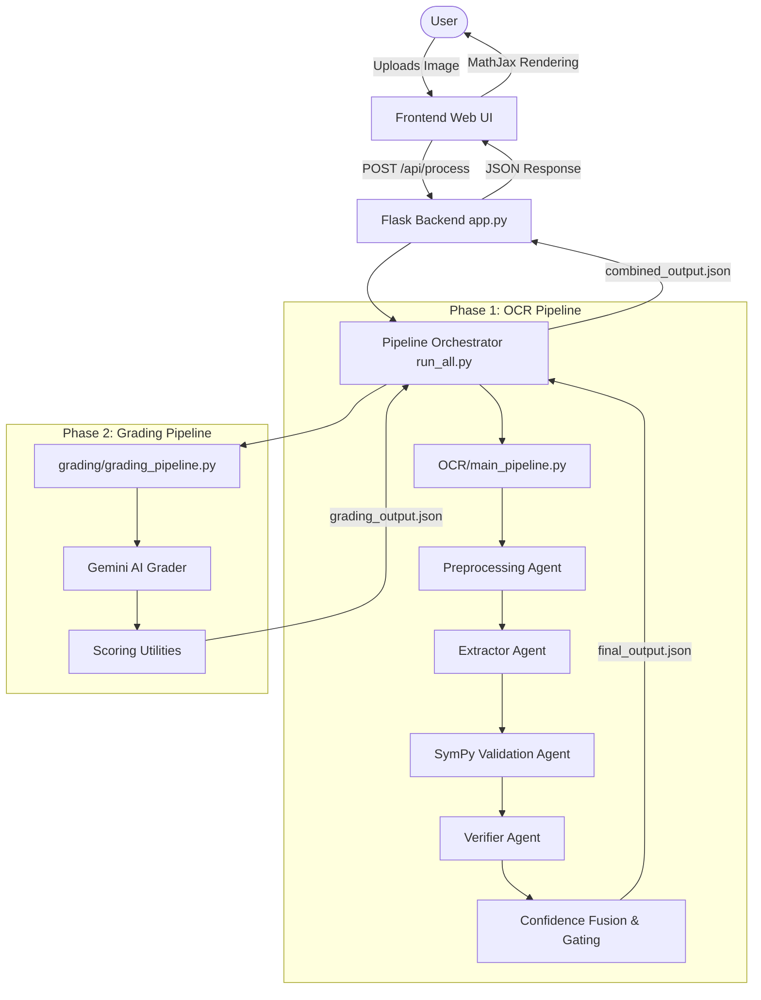

# Multi-Agent Math Grading Pipeline Architecture

## 1. System Overview
The **Multi-Agent Math Grading Pipeline** is an end-to-end system designed to process handwritten or printed mathematical solutions, extract the step-by-step logic, validate the mathematical integrity, and assign a final grade with specific feedback. The system is split into two primary phases: an **OCR/Extraction Phase** and a **Grading Phase**, orchestrated by a lightweight web frontend.

---

## 2. High-Level Architecture Diagram

---

## 3. Core Components

### 3.1. Frontend (Web Application)
* **Stack**: HTML5, CSS3, Vanilla JavaScript, MathJax.
* **Responsibilities**:
  * Provides a drag-and-drop interface for users to upload images of math solutions.
  * Handles the loading state during the heavy pipeline execution.
  * Dynamically parses the JSON response to render structured, visually appealing "Glassmorphism" cards.
  * Utilizes **MathJax** (`$$...$$`) to dynamically render raw LaTeX strings into clean algebraic equations on the browser.

### 3.2. Backend (API Layer)
* **Stack**: Flask (`app.py`).
* **Responsibilities**:
  * Hosts the single `/api/process` POST endpoint.
  * Secures file uploads and isolates the working directory context to the project root (`PROJECT_ROOT`).
  * Triggers the central orchestrator and returns the final JSON to the client.

### 3.3. Orchestrator
* **Component**: `run_all.py`.
* **Responsibilities**:
  * Acts as the bridge between Phase 1 and Phase 2.
  * Sequentially executes the OCR pipeline and then feeds its generated output directly into the Grading pipeline.
  * Compiles the data from both phases into a unified `combined_output.json`.

---

## 4. Phase 1: OCR & Extraction Pipeline (`OCR/`)
The extraction phase employs a multi-agent approach to accurately digitize math solutions.

1. **Preprocessing Agent (`preprocessing_agent.py`)**: 
   * Uses computer vision (OpenCV) to prepare the image.
   * Operations: Grayscale conversion, denoising, CLAHE contrast enhancement, adaptive thresholding, and smart cropping to isolate the mathematical content.
2. **Extractor Agent (`extractor_agent.py`)**: 
   * A generative vision-language model (e.g., Gemma/Gemini) that converts the preprocessed image into a structured sequence of textual and mathematical steps.
3. **SymPy Validation Agent (`sympy_agent.py`)**: 
   * Acts as a symbolic math engine.
   * Parses the extracted LaTeX and checks consecutive steps for mathematical equivalence (e.g., `simplify(step_n - step_n-1) == 0`).
4. **Verifier Agent (`verifier_agent.py`)**: 
   * Cross-references the mathematical output with the visual data. Identifies discrepancies like hallucinated text or misread symbols.
5. **Confidence Fusion (`main_pipeline.py`)**: 
   * A weighted voting algorithm that combines the confidence scores of the Extractor, SymPy, and Verifier.
   * Applies "Gating Logic": If the verifier flags a visual discrepancy or SymPy flags a mathematical contradiction, the final confidence score is severely penalized. Corrected LaTeX from the verifier is injected if the confidence threshold requires it.

---

## 5. Phase 2: Grading Pipeline (`grading/`)
The grading phase takes the digitized mathematical logic and acts as an AI teacher.

1. **AI Grader (`gemini_grader.py`)**: 
   * Analyzes the extracted steps against the detected original problem.
   * Generates step-by-step natural language feedback (e.g., "Correct identification of the algebraic identity").
2. **Scoring Utilities (`scoring_utils.py`)**: 
   * Computes the numerical score for each step.
   * Automatically differentiates between `student_error` (the student made a mathematical mistake) and `extraction_error` (the OCR pipeline failed to read the text perfectly).
   * Allocates a base score and a final score, deducting marks where the student's logic contradicts the correct path.

---

## 6. Output Schema
The pipeline results in a structured JSON payload that is sent to the frontend. The `grading` segment includes:
* `total_score` & `max_score`.
* `overall_feedback`.
* `step_grading`: An array containing `step_id`, `text`, `final_latex`, `base_score`, `final_score`, and the AI's `feedback` for that specific logical jump.
